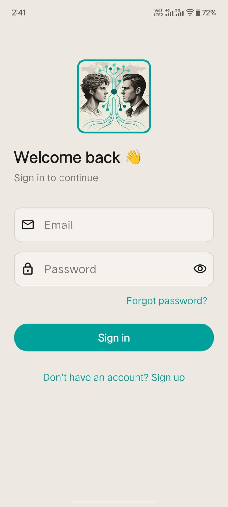
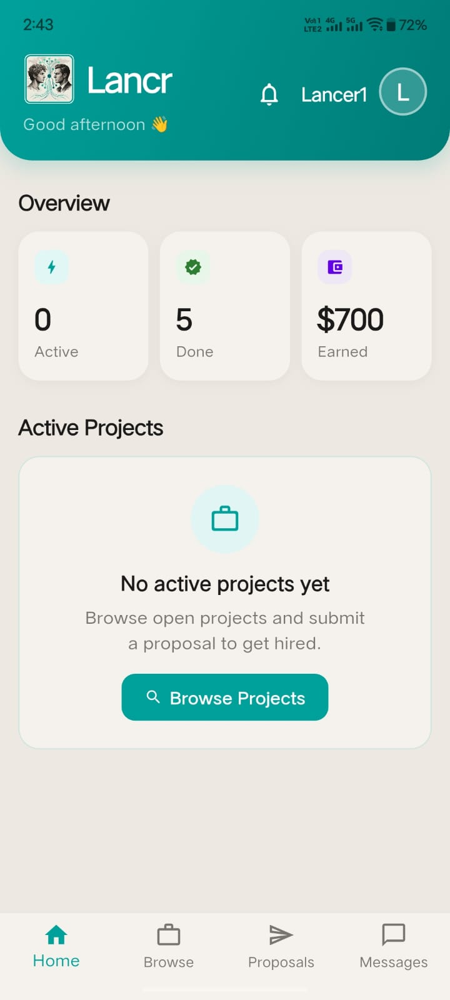
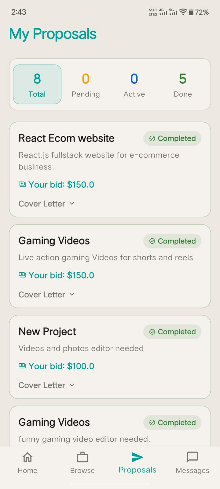
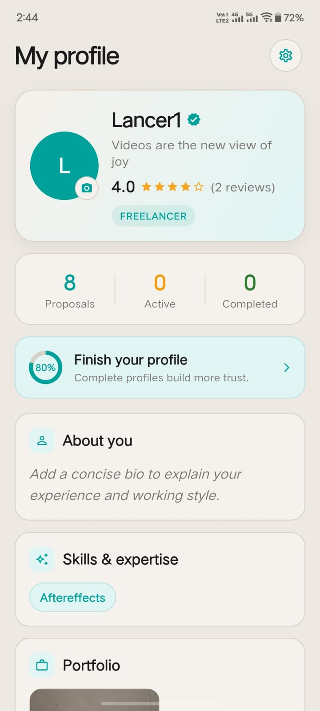
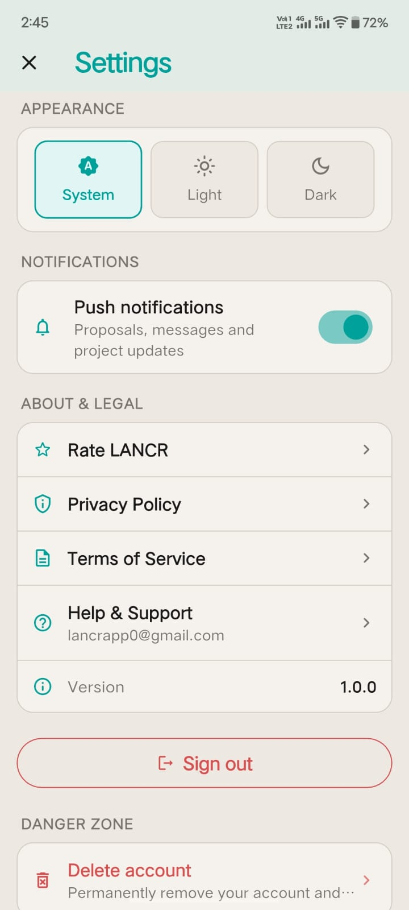
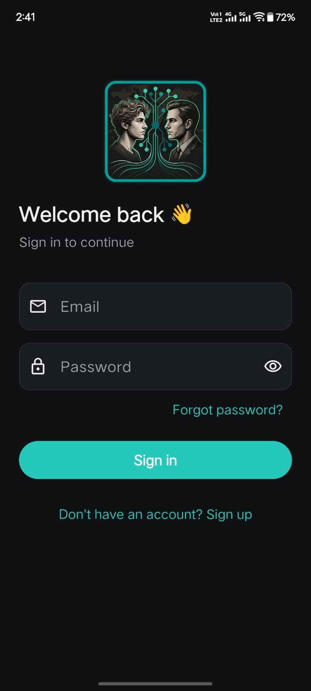
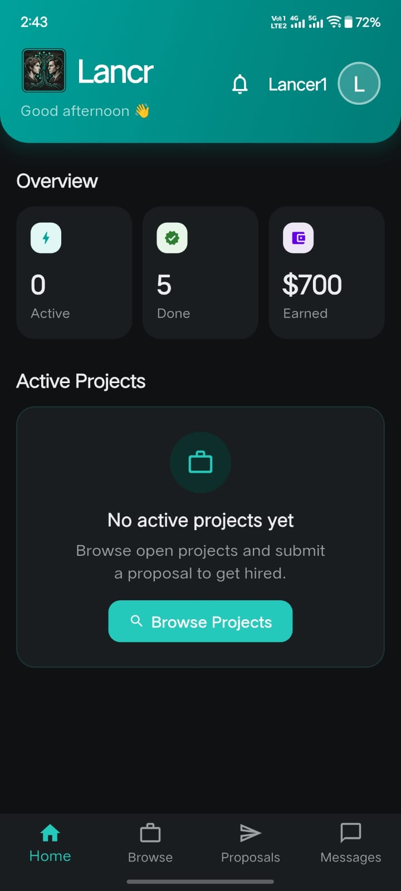
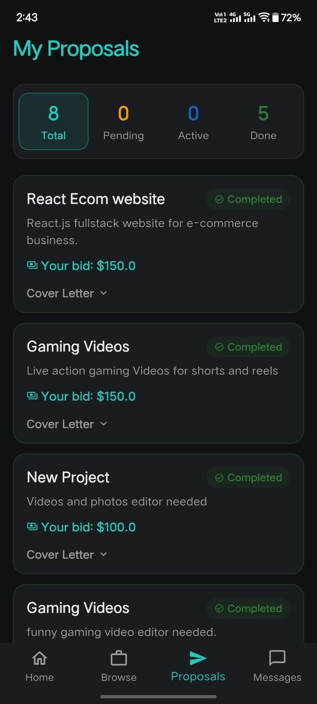
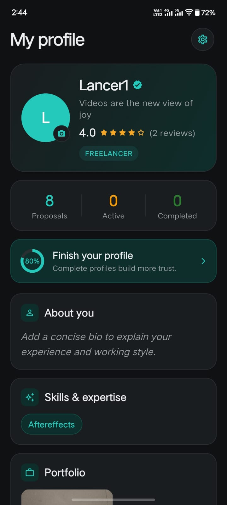
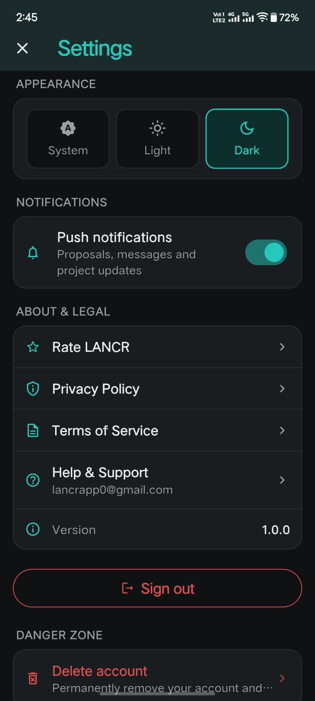

# Lancr — Freelance Marketplace App

A full-stack, Android-first mobile application connecting freelancers with clients. Built with Flutter, Supabase, and Firebase as a portfolio project — now in **closed testing on Google Play**.

<p align="center">
  
</p>


---

## 📱 About

**Lancr** is a freelance marketplace mobile app where clients can post projects and hire talent, and freelancers can browse projects and submit proposals — similar to Upwork or Fiverr, built from scratch as a placement portfolio project.

The app is feature-complete for v1.0.0 (`com.lancr.app`), with real-time messaging, push notifications, reviews, and trust & safety tooling. It is currently being distributed through **Google Play closed testing** ahead of a staged production rollout.

---

## 🎬 Demo

A short screen recording of the app in action — posting, browsing, proposals, chat, and reviews.

<p align="center">
  <a href="https://youtu.be/OkFR6o_GCK4">
    
  </a>
</p>

> ▶️ **[Watch the demo on YouTube](https://youtu.be/OkFR6o_GCK4)**

---

## 📸 Screenshots

> Five core screens — each shown in **light and dark** theme (instant in-app switch).

<table>
  <tr>
    <th>Sign In</th>
    <th>Dashboard</th>
    <th>My Proposals</th>
    <th>Profile</th>
    <th>Settings</th>
  </tr>
  <tr>
    <td></td>
    <td></td>
    <td></td>
    <td></td>
    <td></td>
  </tr>
  <tr>
    <td></td>
    <td></td>
    <td></td>
    <td></td>
    <td></td>
  </tr>
</table>

---

## ✨ Features

### ✅ Completed
- **Authentication** — Email/password login and registration via Supabase Auth
- **Role Selection** — Users choose Freelancer or Client on first login
- **Edit Profile** — Name, headline, bio, skills, location, experience, avatar, portfolio & LinkedIn URLs
- **Public Profile Page** — Profile visible to others with stats and rating summary
- **Portfolio Management** — Freelancers add and manage portfolio items
- **Client Home** — Dashboard with posted-projects overview (counts via a single RPC)
- **Post a Project** — Clients post projects with title, description, budget, **category**, skills, and duration
- **Browse Projects** — Freelancers browse open projects with search, **category filter**, and skill-based filtering
- **Project Detail** — Full project view with client info, budget, category pill, and required skills
- **Saved Projects** — Freelancers bookmark projects and view them on a dedicated `/saved` page
- **Submit Proposal** — Freelancers submit a cover letter and bid amount
- **My Proposals Tab** — Freelancers track all proposals with a stats strip (Total / Pending / Accepted / Rejected)
- **View Proposals** — Clients view all proposals on their project and Accept/Reject
- **My Projects Tab** — Clients manage all their posted projects, with archive + stat filters/sort
- **Project Completion Flow** — Client marks a project as done; updates participant stats
- **Reviews & Ratings** — Post-project ratings/comments that roll up into a profile rating average
- **Real-time Messaging** — In-app chat between client and freelancer after a proposal is accepted
  - Conversation auto-created on proposal acceptance
  - Real-time message delivery via Supabase Realtime
- **Notifications** — In-app notification center **plus push notifications** (FCM) for proposals, messages, and project updates
- **Trust & Safety** — Report and Block users from chat and public profiles; blocked users hidden from Browse and Conversations; "Blocked accounts" management screen
- **Settings** — Light/Dark theme with instant switch, push-notification toggle, blocked accounts, in-app Privacy Policy & Terms
- **Branding** — Custom app icon, native splash screen, and themed in-app logo
- **Crash Reporting** — Firebase Crashlytics wired for live production crash visibility

### 📋 Planned / Future
- In-app payments / escrow for project milestones
- iOS release
- Infinite-scroll pagination and full-text search (tsvector + GIN)
- Advanced filters (budget range, location)

---

## 🛠 Tech Stack

| Layer | Technology |
|---|---|
| Frontend | Flutter 3.x (Dart 3.x) |
| State Management | Riverpod 3.x |
| Navigation | GoRouter |
| Backend / Database | Supabase (PostgreSQL) |
| Authentication | Supabase Auth |
| Realtime | Supabase Realtime (WebSockets) |
| Storage | Supabase Storage |
| Edge Functions | Supabase Edge Functions (Deno) — FCM dispatch |
| Push Notifications | Firebase Cloud Messaging (HTTP v1) + flutter_local_notifications |
| Crash Reporting | Firebase Crashlytics |
| UI | google_fonts, cached_network_image, image_picker |

---

## 🗄 Database Schema

> Key tables (Postgres, `public` schema). All protected by Row Level Security.

### `profiles`
| Column | Type | Description |
|---|---|---|
| id | uuid | References auth.users |
| email | text | User email |
| role | text | `freelancer` or `client` |
| name | text | Display name |
| headline | text | Short professional title |
| bio | text | About me |
| skills | text[] | Array of skills |
| location | text | City / Country |
| company | text | Company name (clients) |
| experience_years | int | Years of experience |
| avatar_url | text | Profile photo |
| portfolio_url / linkedin_url | text | External links |
| rating_avg | numeric | Average review rating |
| rating_count | int | Number of reviews |
| fcm_token | text | Device push token |
| profile_completed | boolean | Onboarding status |
| created_at | timestamptz | Account creation time |

### `projects`
| Column | Type | Description |
|---|---|---|
| id | uuid | Primary key |
| client_id | uuid | References profiles |
| title / description | text | Project details |
| budget_min / budget_max | int | Budget range |
| skills | text[] | Required skills |
| category | text | Project category |
| duration | text | Expected duration |
| status | text | `open`, `closed`, `completed` |
| archived | boolean | Hidden from active lists |
| completion_requested_at / completed_at | timestamptz | Completion flow timestamps |
| created_at | timestamptz | Posted time |

### `proposals`
| Column | Type | Description |
|---|---|---|
| id | uuid | Primary key |
| project_id / freelancer_id | uuid | References |
| cover_letter | text | Proposal message |
| bid_amount | numeric | Proposed price |
| status | text | `pending`, `accepted`, `rejected`, `completed` |
| created_at | timestamptz | Submitted time |

### `conversations` / `messages`
Real-time chat between a project's client and freelancer (participants only). `conversations` tracks `last_message` / `last_message_at`; `messages` holds `sender_id`, `content`, `created_at`.

### `reviews`
| Column | Type | Description |
|---|---|---|
| id | uuid | Primary key |
| project_id | uuid | References projects |
| reviewer_id / reviewee_id | uuid | References profiles |
| rating | smallint | 1–5 |
| comment | text | Optional feedback |
| created_at | timestamptz | Submitted time |

### `notifications`
| Column | Type | Description |
|---|---|---|
| id | uuid | Primary key |
| user_id | uuid | Recipient |
| type | text | Notification type |
| title / body | text | Display content |
| data | jsonb | Deep-link payload |
| read | boolean | Read state |
| created_at | timestamptz | Created time |

### `saved_projects`, `reports`, `blocked_users`
- **`saved_projects`** — `freelancer_id`, `project_id` (bookmarks)
- **`reports`** — `reporter_id`, `reported_user_id`/`reported_project_id`, `reason`, `details`, `status`
- **`blocked_users`** — `blocker_id`, `blocked_id`

---

## 📁 Project Structure
```
lib/
├── core/
│   ├── config/        # env, GoRouter (with theme-aware page wrapping)
│   ├── models/
│   ├── notifications/ # push_service.dart (FCM registration + handlers)
│   ├── presentation/  # main_shell_page.dart (bottom-nav shell)
│   └── theme/         # app_colors.dart, app_theme.dart (runtime light/dark)
│
├── features/
│   ├── auth/          # login, register, auth_provider
│   ├── onboarding/    # role_selection_page
│   ├── profiles/      # profile, public_profile, edit_profile
│   ├── portfolio/     # manage_portfolio_page
│   ├── projects/      # home, browse, post, detail, completion, saved, categories
│   ├── proposals/     # submit, view, my_proposals (+ data/ repository)
│   ├── messages/      # conversations, chat (Supabase Realtime)
│   ├── reviews/       # review widgets, repository, provider
│   ├── notifications/ # notifications center + provider
│   ├── moderation/    # report/block widgets, blocked_accounts_page
│   └── settings/      # settings_page (theme, push, blocked, legal)
│
└── main.dart          # Firebase + Supabase init, error handlers
```

---

## 🧭 Navigation Routes

| Route | Page | Access |
|---|---|---|
| `/` | SplashPage | All |
| `/auth/login` · `/auth/register` | Login / Register | Public |
| `/onboarding/role` | RoleSelectionPage | New users |
| `/home` · `/client/home` | MainShellPage / Client home | Authenticated |
| `/projects/post` · `/projects/:id/edit` | Post / Edit project | Client |
| `/projects/browse` | BrowseProjectsPage | Freelancer |
| `/client/projects` | ClientProjectsPage | Client |
| `/projects/:id` | ProjectDetailPage | All |
| `/projects/:id/submit-proposal` | SubmitProposalPage | Freelancer |
| `/projects/:id/proposals` | ViewProposalsPage | Client |
| `/projects/:id/completion` | ProjectCompletionPage | Client |
| `/saved` | SavedProjectsPage | Freelancer |
| `/portfolio/manage` | ManagePortfolioPage | Freelancer |
| `/profile/edit` · `/profile/me` · `/profile/:id` | Profile pages | All |
| `/notifications` | NotificationsPage | Authenticated |
| `/settings` · `/settings/blocked` | Settings / Blocked accounts | Authenticated |
| `/legal/privacy` · `/legal/terms` | Privacy / Terms | All |
| `/messages` · `/messages/:id` | Conversations / Chat | All |

---

## 🚀 Getting Started

### Prerequisites
- Flutter 3.x SDK / Dart 3.x
- A Supabase project
- A Firebase project (for FCM push + Crashlytics)

### Setup

1. **Clone the repo**
   ```bash
   git clone https://github.com/KoshtiHarshal/LANCR.git
   cd LANCR
   ```

2. **Install dependencies**
   ```bash
   flutter pub get
   ```

3. **Configure Supabase** — set your project URL and anon key (see `lib/core/config/env.dart` / `main.dart`).

4. **Configure Firebase** — add `android/app/google-services.json` for your Firebase project (required for push notifications and Crashlytics).

5. **Run the app**
   ```bash
   flutter run
   ```

> Secrets (`key.properties`, `*.jks`) are gitignored and not tracked.

---

## 🔐 Security

- Row Level Security (RLS) enabled on all tables
- Freelancers can only view/submit their own proposals; clients only see proposals on their own projects
- Conversations and messages restricted to participant users only
- Reviews limited to the project's participants; reports and blocks scoped to the acting user
- Profile and notification data protected per user via `auth.uid()`
- Push tokens stored per user and cleared when push is disabled

---

## 👨‍💻 Developer

**Harshal Koshti**
- 4th Year Computer Engineering (Software Engineering) Student
- 📍 Surat, Gujarat, India
- 🔗 [LinkedIn](https://linkedin.com/in/harshalkoshti01)
- 🐙 [GitHub](https://github.com/KoshtiHarshal)

---

## 📌 Project Status

> ✅ **v1.0.0 — feature-complete and in closed testing on Google Play.**

The app (`com.lancr.app`) ships as a signed release bundle with push notifications verified on the production build and Crashlytics live. It is currently running a Google Play **closed test** ahead of applying for production access and a staged rollout.

Built as a placement portfolio piece to demonstrate full-stack mobile development with Flutter + Supabase + Firebase.

---

## 📄 License

Copyright © 2026 Harshal Koshti. All rights reserved.

This project is currently closed source. The code is shared publicly
for portfolio and demonstration purposes only. Copying, distributing,
or building upon this project without explicit written permission
from the author is not permitted.
